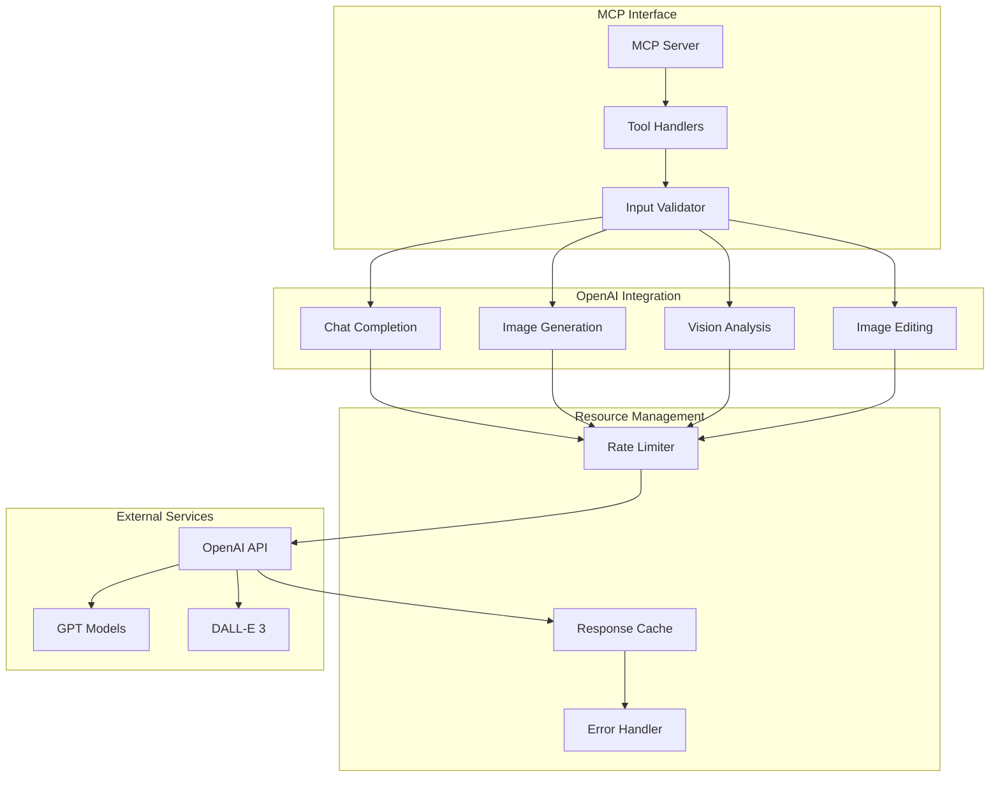
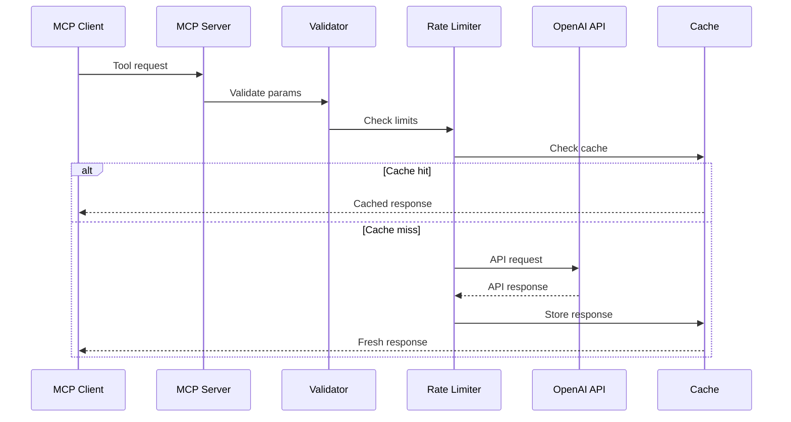

# OpenAI Complete MCP Server Architecture

## Overview

The OpenAI Complete MCP Server provides comprehensive OpenAI API access through Model Context Protocol, enabling AI assistants to utilize GPT models, DALL-E image generation, and vision capabilities.

## Architecture Diagram



## Core Components

### 1. MCP Server (`src/mcp-server.ts`)
- Implements MCP protocol interface
- Exposes OpenAI capabilities as tools
- Handles request/response lifecycle

### 2. Tool Handlers
- **Chat Handler**: Text generation and conversation
- **Image Handler**: DALL-E image creation
- **Vision Handler**: Image analysis and understanding
- **Edit Handler**: Image manipulation

## Available Tools

### 1. **chat**
Complete text generation with GPT models.
```typescript
interface ChatParams {
  messages: Message[];
  model?: string;        // Default: gpt-4
  temperature?: number;  // 0-2, default: 0.7
  max_tokens?: number;   // Default: 1000
  system?: string;       // System prompt
}
```

### 2. **generate_image**
Create images with DALL-E 3.
```typescript
interface ImageParams {
  prompt: string;
  size?: '1024x1024' | '1024x1792' | '1792x1024';
  quality?: 'standard' | 'hd';
  style?: 'vivid' | 'natural';
  n?: number;  // Number of images
}
```

### 3. **analyze_image**
Vision analysis of images.
```typescript
interface VisionParams {
  image_url: string;
  prompt: string;
  max_tokens?: number;
  detail?: 'low' | 'high' | 'auto';
}
```

### 4. **edit_image**
Modify existing images.
```typescript
interface EditParams {
  image_url: string;
  mask_url?: string;
  prompt: string;
  size?: string;
  n?: number;
}
```

### 5. **chat_with_image**
Multimodal conversation with images.
```typescript
interface MultimodalParams {
  messages: Message[];
  image_urls: string[];
  model?: string;
  max_tokens?: number;
}
```

### 6. **create_variations**
Generate variations of an image.
```typescript
interface VariationParams {
  image_url: string;
  n?: number;
  size?: string;
}
```

## Request Flow



## Error Handling

### API Errors
```typescript
enum OpenAIError {
  RATE_LIMIT = 'rate_limit_exceeded',
  INVALID_KEY = 'invalid_api_key',
  QUOTA_EXCEEDED = 'quota_exceeded',
  MODEL_OVERLOADED = 'model_overloaded',
  INVALID_REQUEST = 'invalid_request'
}
```

### Retry Strategy
- Exponential backoff for rate limits
- Automatic retry for transient errors
- Graceful degradation for persistent failures

## Performance Optimizations

### 1. Response Caching
- LRU cache for repeated requests
- TTL-based expiration
- Cache key generation from parameters

### 2. Rate Limiting
- Token bucket algorithm
- Per-model rate limits
- Automatic queue management

### 3. Streaming Support
- Server-sent events for long responses
- Chunked transfer encoding
- Real-time token generation

## Security Considerations

### 1. API Key Management
- Environment variable storage
- No key logging or exposure
- Secure transmission only

### 2. Input Sanitization
- Prompt injection prevention
- Content filtering
- Parameter validation

### 3. Output Filtering
- PII detection
- Content moderation
- Response sanitization

## Configuration

### Environment Variables
```bash
OPENAI_API_KEY=sk-...          # Required
OPENAI_ORG_ID=org-...          # Optional
DEFAULT_MODEL=gpt-4            # Default model
MAX_TOKENS_DEFAULT=1000        # Default max tokens
CACHE_TTL=3600                 # Cache TTL in seconds
RATE_LIMIT_RPM=60              # Requests per minute
```

### Model Selection
```typescript
const AVAILABLE_MODELS = {
  chat: ['gpt-4', 'gpt-4-turbo', 'gpt-3.5-turbo'],
  image: ['dall-e-3'],
  vision: ['gpt-4-vision-preview']
};
```

## Usage Examples

### Text Generation
```javascript
await mcp.call('chat', {
  messages: [
    { role: 'user', content: 'Explain quantum computing' }
  ],
  model: 'gpt-4',
  temperature: 0.7
});
```

### Image Creation
```javascript
await mcp.call('generate_image', {
  prompt: 'A futuristic city at sunset, cyberpunk style',
  size: '1792x1024',
  quality: 'hd',
  style: 'vivid'
});
```

### Vision Analysis
```javascript
await mcp.call('analyze_image', {
  image_url: 'https://example.com/image.jpg',
  prompt: 'What objects are in this image?',
  detail: 'high'
});
```

## Monitoring

### Metrics Tracked
- API call volume
- Token usage
- Error rates
- Response times
- Cache hit ratio

### Logging
- Request/response logging
- Error tracking
- Performance metrics
- Usage analytics